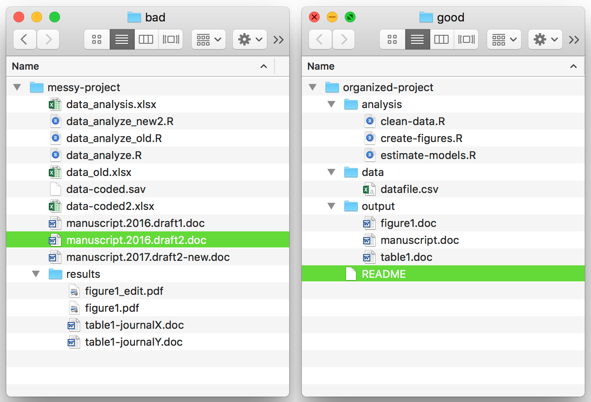
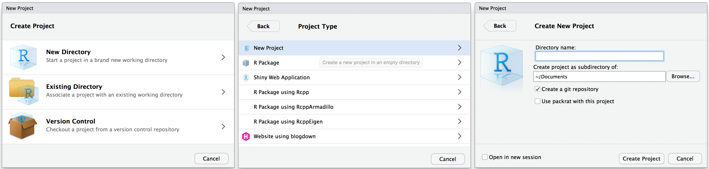
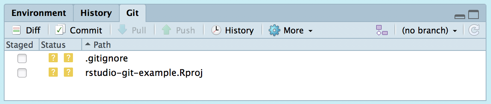
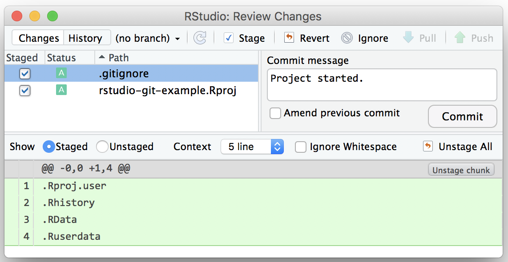
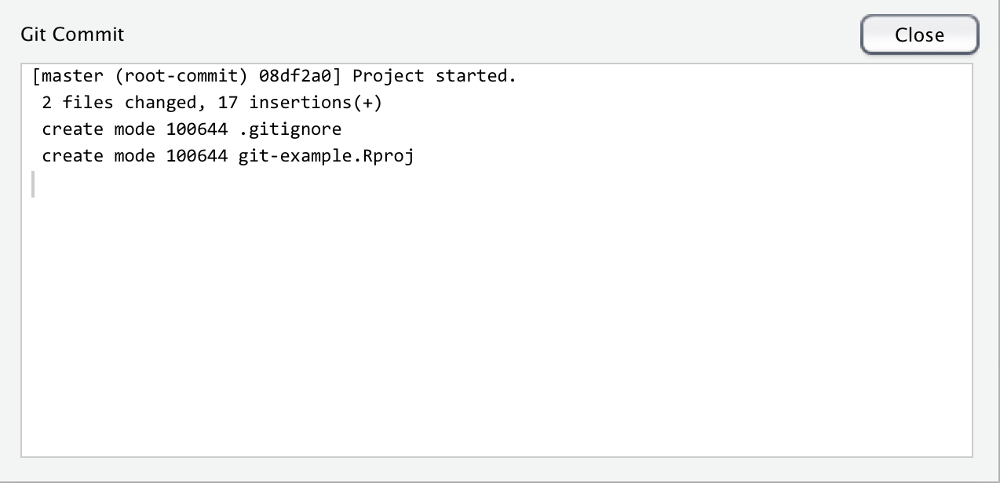
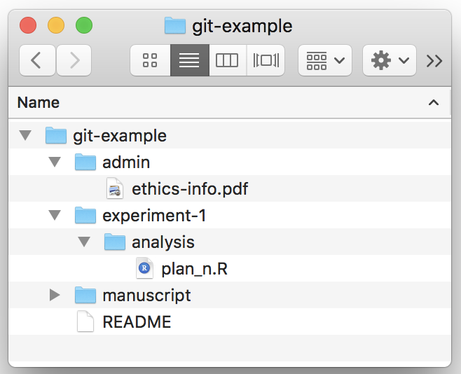
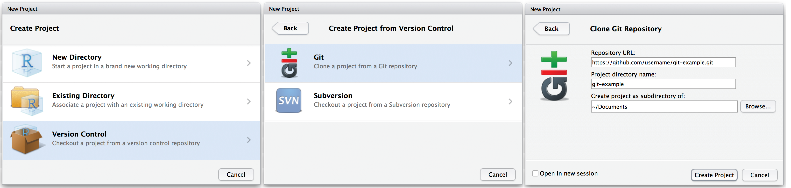
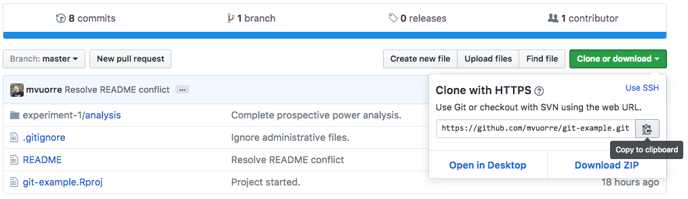
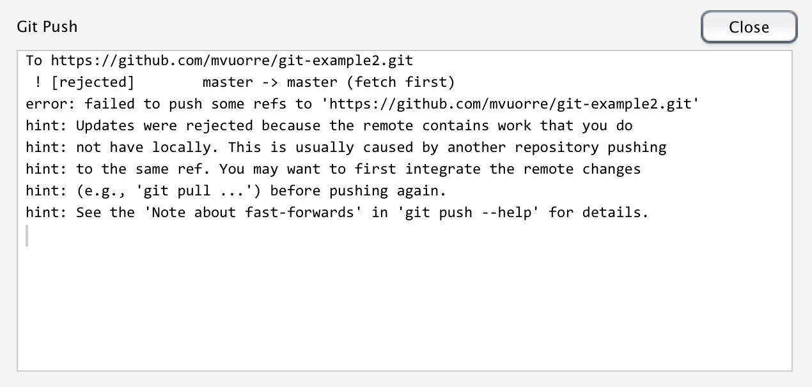
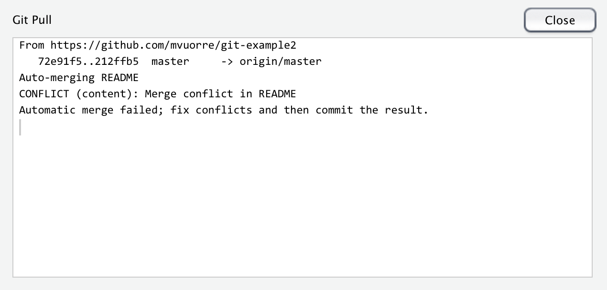

```{r include = FALSE}
library(knitr)
opts_chunk$set(
    fig.align = "center",
    root.dir = "../"
)
library(papaja)
library(tidyverse)
```

\newpage
# Introduction

Lack of reproducibility is increasingly recognized as a problem across scientific disciplines, and calls for changing the scientific workflow to enhance reproducibility have been published in a wide range of research areas, including biology [@markowetz_five_2015], ecology [@ihle_striving_2017], neuroscience [@eglen_toward_2017] and psychology [@munafo_manifesto_2017]. Studies suggest that one specific challenge to reproducibility is the ways in which researchers organize, curate, share, and collaborate on their research assets [@vanpaemel_are_2015; @wicherts_poor_2006]. By assets, we mean e.g. stimuli, data, and code used to support a research article's conclusions. 

Fortunately for the empirical sciences, challenges related to curating materials across time, space, and collaborators have been solved to a high standard in software development with Version Control Systems (VCS). In this tutorial article, we introduce a popular VCS called Git, and illustrate its use in the scientific workflow with a hypothetical example project. We show how to use Git with a Graphical User Interface (GUI) in the R Studio program [@rstudio_team_rstudio:_2016], and include an online appendix for more advanced command line Git functions. We also show how to use Git with the online service GitHub for collaborative workflows. Learning how to use Git(Hub) will streamline workflows and help researchers stay better organized, and thereby facilitate reproducibility.

## Version Control Systems

Consider collaborating on a manuscript which reports results from a data set using some statistical model. In a typical workflow, one person might format the raw data in a specific way to fit a statistical model, and then write a draft of the manuscript. This would create three files: `data.csv`[^csv], `analysis.R`[^r-file], and `manuscript.docx`. If a collaborator then decided to use another statistical model, which requires the data in a different format, and then edited the manuscript, she would create three more files: `data_new.csv`, `analysis_new.R`, and `manuscript_new.docx`. This cycle would then repeat as many times as required, each time creating more files, making it more and more difficult for the authors to remember which data was paired with which analysis, and which analyses were reported in which version of the paper. 

[^csv]: `.csv` stands for comma separated values, and is a plain text file commonly used to store two-dimensional data. `.csv` files can be considered as machine-readable spreadsheets.
[^r-file]: A file with the `.R` extension contains computer code in the R language for conducting statistical analyses.

With VCS, the project would contain three files only (data, analysis, and manuscript). The VCS would keep track of changes to the files and their different versions, therefore removing the need for new files for every new idea or edit. This lack of duplicity, in turn, may reduce room for error in remembering which data file was linked with which analysis, and which manuscript version had the correct numerical results, and so forth. Box 1 shows practical examples of scenarios where VCS can be used to improve the scientific workflow. We compare VCS to other common workflow tools at the end of this article. To get a birds-eye view of the Git workflow, readers can refer to Figures \@ref(fig:git-diagram) and \@ref(fig:git-diagram-collaborate).

VCS were initially developed for writing code collaboratively[^vcs-collaborate], but are increasingly being adopted to enhance workflows outside computer science. To help understand why, it is helpful to think of "code" more broadly as any text written on a computer: Manuscripts, books, statistical analysis scripts, source code of computerized experiments, and even data files are "code", or have source code. Code is just plain text written on a computer, and when we use the word "code" in this tutorial, we mean it in this broad sense (e.g. this manuscript's source "code" was written on a computer, and was version controlled.[^repo-address]) Furthermore, metadata, stimuli, study notes, and other research documents often go through multiple revisions, and could therefore benefit from being version controlled.

[^vcs-collaborate]: The software we present below is used by major software developers such as Microsoft, Google, and Facebook on code bases with hundreds of contributors.
[^repo-address]: This manuscript's source can be found at <https://github.com/mvuorre/reproguide-curate>.

For example, a computerized experiment's source code (text written by humans but interpreted by computers to e.g. display stimuli to participants) may have multiple authors and go through multiple versions. Keeping track of the program's versions and changes to its source code, and allowing many authors to contribute to it (without breaking the experimental program) are problems that VCSs were specifically designed for. Writing manuscripts is quite similar, at least as far as the computer is concerned: Multiple authors write multiple versions of a text document, and sometimes previous versions need to be inspected, and the text needs to be merged across the many authors. Even datasets can be considered as plain text "code": In most computerized experiments, the output data are numbers and text written into a text file. These files can be version controlled, and researchers would usually not want to see that their raw data files have changed after they were created---VCS allows verifying that they haven't changed because their history is preserved.

<!-- Box: Examples of How Git facilitates the scientific workflow. -->
\begin{tcolorbox}[colframe=green!50!black, colback=green!5, fonttitle=\small\bfseries, fontupper=\small, title=Box 1. How Git facilitates the scientific workflow.]
Share work easily, safely, and in an organized manner.
    \begin{compactitem}
    \item Git enforces a common organization scheme among collaborators, making it easier to keep everyone "on the same page" with what goes where, and how to contribute to specific parts of the project. Git projects are shared as a whole, so complex projects with multiple files linking to each other are easy to share. Sharing projects with others is built into Git, and can be facilitated with online services such as GitHub: Once a project uses Git, it can be easily copied to GitHub, from where others can download the entire project onto their local computers.
    \end{compactitem}
\vspace{.5em}
Try different ways of visualizing data while keeping track of the variants.
    \begin{compactitem}
    \item Whenever requested, Git saves a file's current version, allowing testing new features without losing previous versions or proliferating files in the project's directories. Any past version can be retrieved from Git's history. 
    \end{compactitem}
\vspace{.5em}
Work on the same code or manuscript files at the same time as collaborators.
    \begin{compactitem}
    \item Collaborators work on their local projects and send and receive material to and from a central copy of the project. Git keeps track of who has done what, when, and (possibly) why. Git never loses information or overwrites work with another collaborator's work, unless asked to do so, but allows for collaborators to work on the same ideas simultaneously. 
    \end{compactitem}
\end{tcolorbox}

The core concepts of version control are that contributors to a project create small checkpoints of the changes they make to the source code---analogous to saving an intermediate version of a file on the computer's hard disk---and then submit those changes to the VCS. The VCS maintains a history of changes to the code between these little checkpoints, and therefore allows coming back to any earlier version by browsing the history. These concepts---i.e. the typical Git workflow---is illustrated in Figure \@ref(fig:git-diagram).

```{r git-diagram, fig.cap = "A diagram illustrating the typical Git workflow. Verbs indicated in bold text are Git operations and explained in detail in the main text. In brief, this workflow consists of making changes to files in the project (such as editing a manuscript.) Once the revised version of the file is saved, the user adds the changed file to the staging area (1). Many files can be added to the staging area, if desired. Once the changes in the staging area reflect a conceptual entity, such as edits to an image file and its accompanying caption in the manuscript, the user then commits the changes to Git's history (2). These commits are accompanied with short commit messages that describe the changes made in that commit. Finally, when needed, changes to files can be discarded by retrieving (checking out) an earlier version of the file from Git's history. We explain these terms and operations in more detail in the main text. Figure adapted from https://git-scm.com/book/en/v2/Getting-Started-Git-Basics."}
knitr::include_graphics("../data/git-diagram.pdf")
```

## The Git Version Control System

Version control software has a long history in software engineering, and there are many VCS programs. Some popular ones are Apache Subversion[^subversion], Mercurial[^mercurial], and Git[^git-name]. In this tutorial, we focus on Git because it is already increasing in popularity within the scientific community, and is especially good for scientific collaboration because of online tools which allow seamless collaboration even for very large research teams. Further, Git is free and open source, works on Windows, Mac, and Linux operating systems (among others). 

[^subversion]: <https://subversion.apache.org/>
[^mercurial]: <https://www.mercurial-scm.org/>
[^git-name]: <https://git-scm.com/>. The creator of Git, Linus Torvalds (who also is the principal developer of the Linux operating system), named Git after himself as "the stupid content tracker" (@mcmillan_after_2005; <https://git-scm.com/docs/git.html>)

Most computer users are already familiar with creating, copying, and deleting files and folders on their computers with the operating system's (OS) default file viewer (Mac's Finder, Windows' File Explorer). Git adds functionality to the computer's file system by making available a set of commands---either executed from a graphical point-and-click user interface (GUI) or from the computer's command line---which allow keeping track of files and their history, and distributing the files across multiple computers and users. Importantly, Git does not move or change the files or folders in any way: Users still interact with their files as they would without Git, but instead of creating new files to indicate important changes, they can use Git to save the files' current state to Git's history, from which old versions can be retrieved.

## Installing Git

Even if you already have Git installed (some computers do) it is good practice to install the latest version[^git-version], which can be downloaded from <https://git-scm.com/download>. Because Git is a standalone program, it is easy to install by simply downloading the installer, and following the on-screen instructions. For Mac users, the easiest way to install or update Git to the latest version is to download the installer from <http://git-scm.com/download/mac>, and install it like any other program. Similarly, Windows users can download the Git software installer from <http://git-scm.com/download/win> and install it like any other application. Linux (and other) users can download Git and find further install instructions on the Git website (<https://git-scm.com/book/en/v2/Getting-Started-Installing-Git>). 

[^git-version]: As of the writing of this article, the current version of Git is 2.13.1.

After the Git software has been installed, its functions are available to the computer's users through various Git clients. In this tutorial, we show how to use Git with R Studio. We also present more detailed instructions for using Git from the command line in the supplement[^supplement-url].

[^supplement-url]: The supplemental file can be accessed on this project's GitHub repository: <https://github.com/mvuorre/reproguide-curate/blob/master/manuscript/supplement.pdf>.

# Using Git with a Graphical Interface

The first operating principle of Git is that your work is organized into independent projects, which Git calls *repositories*[^git-link-submodules]. A repository is a folder on your computer which is version controlled by Git[^git-folder], and can itself contain subfolders. Everything that happens inside a repository is tracked by Git, but you have full control of what is committed to Git's history and when. Because you have full control of what and when is committed to history, there is a small set of operations you need to know[^git-cheat-sheet].

[^git-link-submodules]: For advanced users, Git *submodules* allow linking projects to each other, or organizing more complex projects into projects and their sub-projects (<https://git-scm.com/book/en/v2/Git-Tools-Submodules>).
[^git-cheat-sheet]: It helps to have a Git command cheat sheet (<https://services.github.com/resources/cheatsheets/>) printed and taped on your wall, but it contains many more commands than are needed for the basic use of Git in standard Psychology studies.
[^git-folder]: There are no visible changes to a folder once it is tracked by Git. Once Git is initialized in a folder, the only change is that a hidden folder, called `.git` is added, but users do not need to interact with it directly.

Briefly, when you work in a Git repository (make changes to files within it), Git monitors the state of each file, and when they change Git knows that they differ from the previously logged state. If you are happy with the current changes, you **add** the changed files to Git's "staging area". If you then are certain that the changes in the staging area are desirable, you **commit** the changes. These two operations are the backbone of using Git to store the state of the project whenever meaningful changes are made. Importantly, each commit in the repository's history contains information to recover the full state of the project at that point in time. Users can always go back to an earlier version by **checking out** a previous state from Git's history (Figure \@ref(fig:git-diagram)).

To understand the Git workflow in practice, we now turn to a practical example using a hypothetical project. Git can be added to a project at any stage of the project's life cycle, but to most clearly show its use, we begin with an empty project. The GitHub repository (explained below) for this hypothetical example project can be found at <https://github.com/mvuorre/git-example>.

<!-- Box: Git summary -->
\begin{tcolorbox}[colframe=green!50!black, colback=green!5, fonttitle=\small\bfseries, fontupper=\small, title=Box 2. Main Git operations and terms.]
Git
    \begin{compactitem}
    \item A Version Control System program, designed to track changes to files.
    \end{compactitem}
Git repository
    \begin{compactitem}
    \item A folder whose contents are tracked by Git. Changes within this folder can be saved to Git's history. Git repositories are located on users' computers, and are therefore also called local repositories.
    \end{compactitem}
GitHub repository
    \begin{compactitem}
    \item GitHub repositories can be set to receive changes from local repositories, allowing multiple users to work on the same project by connecting their local repositories to the GitHub one, which is also called a remote repository. 
    \end{compactitem}
Initialize a local repository
    \begin{compactitem}
    \item Create a local Git repository in a computer's folder. 
    \end{compactitem}
Clone a remote repository
    \begin{compactitem}
    \item Create a local Git repository by copying a remote repository, e.g. one hosted on GitHub.
    \end{compactitem}
Add changes to a file to Git's staging area
    \begin{compactitem}
    \item After making changes to a file(s), they can be added to Git's staging area. Only changes that are added to the staging area can be committed, allowing for better control over what is saved in Git's history. For instance, if changes to file X are relevant to a commit, but changes to file Z are not, X can be added to the staging area and committed without committing changes to Z.
    \end{compactitem}
Commit (save) changes from the staging area to Git's history
    \begin{compactitem}
    \item Commits create snapshots of the project's current state by saving changes from the staging area to Git's history. Commits can include short messages describing the commit's purpose.
    \end{compactitem}
Git History
    \begin{compactitem}
    \item Git's history (or "log") is a list of all the commits made in the repository.
    \end{compactitem}
Push (send) committed changes from local to remote repository
    \begin{compactitem}
    \item Collaborators work on their local repositories, and periodically send their changes to the central (remote) repository.
    \end{compactitem}
Pull (receive) changes from the remote repository
    \begin{compactitem}
    \item To keep the local repository up-to-date with other collaborators' changes, users periodically pull changes from the remote (central) repository. 
    \end{compactitem}
\end{tcolorbox}

## R Studio

R Studio[^rstudio-link] is an integrated development environment (IDE; @rstudio_team_rstudio:_2016) for the R programming language [@r_core_team_r:_2017][^r-not-required]. It incorporates tools that are useful throughout the scientific research cycle, including project organization, data analysis, and writing manuscripts. To these ends, R Studio also includes a graphical interface for using Git. 

[^rstudio-link]: R Studio is a free and open source IDE, works on Windows, Mac, and Linux operating systems, and can be downloaded from the project's website at <https://www.rstudio.com/products/rstudio/download/>.
[^r-not-required]: Although in this example we refer to the R programming language, Git can be used through the R Studio GUI even if you do not use R (or any other programming language.) 

## Organizing Files and Folders

Implementing reproducibility into the scientific workflow is less time-consuming and effortful if it is planned from the onset of the project, rather than added to the project after all the work has been completed. It is therefore important to organize the project keeping a few key goals in mind (here, we follow guidelines such as the Project TIER recommendations[^tier-link]): Files and folders should have easy to understand names (avoid idiosyncratic naming schemes), and the names should indicate the purposes of the files and folders. We illustrate some good and not-so-good practices in Figure \@ref(fig:organizing-files).

[^tier-link]: <http://www.projecttier.org/tier-protocol/specifications/>

```{r organizing-files, fig.cap = "Organizing a project's files and folders helps potential collaborators (including yourself in the future) to quickly and reliably find the correct files. Some bad practices (left panel) include having multiple versions of each file, increasing the potential for e.g. accidentally using the wrong data for the analysis, or forgetting which version was used in the analysis. Better practices (right panel) organize the data to subfolders with meaningful names, and have one file per purpose. These files are then versioned using Git, eschewing the need for multiple files, thereby reducing potential for mistakes."}

```

The project's folder should have an immediately recognizable name, and should be placed somewhere on your computer where you can find it. We call the example project (and therefore its home folder) `git-example`. Because the folder structure on a computer is easy to think of as a tree, a project's home folder---or any folder that has sub-folders---is also known as the *root* directory. In what follows we use the terms home directory and root (directory) interchangeably. 

Managing projects, their folders, and Git repositories with R Studio is centered on the idea of R Projects. To start a new project with R Studio, open the R Studio application, and click File -> New Project[^rstudio-video-tutorial]. This brings up a dialog (left panel in Figure \@ref(fig:rstudio-project-1)) asking whether to create a project in a new directory, existing directory, or checkout an existing project from a version control repository. Here, we create the project in a new directory. We then choose "New Project" (old R Studio versions may instead have "Empty Project") in the following screen (middle panel in Figure \@ref(fig:rstudio-project-1)). We'll then give a name to the project's home folder (`git-example`) and choose where to save it on the computer. Importantly, we'll also check the "Create a git repository" box (right panel in Figure \@ref(fig:rstudio-project-1)), which will automatically set up a new repository for the project. Clicking "Create project" creates the folder in the specified location, and two files inside the project's main folder.

[^rstudio-video-tutorial]: For a video tutorial showing how to set up Git with R Studio, please see <https://pagepiccinini.com/r-course/lesson-0-introduction-and-set-up/>.

```{r rstudio-project-1, fig.cap = "Creating a project in R Studio.", out.width="6in"}

```

One of these files is `.gitignore` which we will discuss in more detail below. The other file is an `.Rproj` file, which indicates that the folder is the home folder for an R (Studio) project. Users don't interact with this file directly, but if opened, it is a plain text file containing the project's settings (these can be modified through Tools -> Project Options in R Studio).

## Using Git with R Studio

Once the R Project has been created, R Studio has a "Git" panel in the top-right panel of the GUI (Figure \@ref(fig:rstudio-git-1)). This panel shows the two new files in the repository, and buttons for the main Git commands. Because the project's main folder is initialized as a Git repository, Git monitors any changes within it, and allows you to add and commit these changes (Figure \@ref(fig:git-diagram).) 

```{r rstudio-git-1, fig.cap = "R Studio's Git tab for a newly created project. The Git tab in R Studio has buttons for Git commands covered in this tutorial, such as viewing Git's history, diffs, and commits."}

```

### Adding Files to Git

To mark this milestone of creating a project, you can commit all the changes so far to Git. To begin committing these changes, click on "Commit" in the Git panel. This brings up another window (Figure \@ref(fig:rstudio-git-2)) where you can select files to add into the staging area. R Studio indicates that there are two new files in the repository with yellow question marks in the Status column, in the upper left panel of Figure \@ref(fig:rstudio-git-2). To **add** these new files to Git's staging area, select the radio buttons in the "Staged" column. This will turn the files' status to a green "A", as shown in Figure \@ref(fig:rstudio-git-2). The text highlighted in green in the bottom part indicates the lines of text which were changed in the selected file (`.gitignore`). These lines are all green because the file is new to Git and therefore each change is an addition (we will discuss the contents of this file in more detail below.)

We have now added the files to Git's staging area, and if we are happy with changes to the files' status, we can **commit** the file to Git's history. Before clicking "Commit", write a short message to the "Commit message" box describing what changed and why. These messages will be important when you later browse the history of your repository.  After you click the "Commit" button, R Studio pops up a window summarizing the commit's changes (Figure \@ref(fig:rstudio-git-3)). 

```{r rstudio-git-2, fig.cap = "Creating a Git commit with R Studio."}

```

Every project (repository) should contain a brief note explaining what the project is about and who to contact. This note is usually called a readme file, and therefore our first proper contribution to this project will be a README file[^readme-caps]. Although it might seem odd to document such trivia when working solo on a project, it is easier for you and others (for example, someone else continuing your project later on) to recall what the project was about if this information is available.

[^readme-caps]: The README file is so important that it has become standard practice to write its file name in capital letters. We follow this tradition in the current manuscript, but note that the capital letters are a tradition, not a requirement. 

The README file should be a plain text `.txt` file (i.e. not created with Microsoft Word or similar) that can be read with a simple text editor[^plain-text]. Create this file with R Studio's text editor (click "File" -> "New File" -> "Text File"), and save it to the project's root folder. Once you have saved the file (into the project's home folder), it will be visible in R Studio's Git panel (with yellow question marks, indicating it is a new file). Once you are happy with the README file's contents, stage the file by checking the radio button, write a commit message, and click "Commit". This initial version of the README file is now saved in Git's history, and can be later retrieved. Notice also that after the commit the Git panel in R Studio is empty; there are no changes to the repository.

[^plain-text]: Plain text has many advantages over proprietary file formats such as Microsoft Word's .docx files. Briefly, plain text is both human and computer readable (.docx are unreadable without a copy of Microsoft Word), is both forward and backward compatible (there will always, and has always been, software capable of reading it), and plain text takes very little space. The file extension (the `.docx` part of a Word file's name, for example) of plain text doesn't matter much, but we recommend using either `.txt` because it is widely recognized, `.md` for markdown syntax, or in the case of a readme file, simply not using any file extension.

```{r rstudio-git-3, fig.cap = "Git's description of changes within a commit. This commit changed two files and inserted a total of 17 lines of text. The rest of the information can be safely ignored, and users can press 'Close' to proceed."}

```

## Keeping Track of Changes with Git

Git now keeps track of all and any changes to README (and the two other files in the `git-example` project, which we ignore for now). To illustrate, you can change the text in the README file with R Studio's text editor, save the file, and then see that R Studio's Git panel now shows the README file with a blue "M" (modified) flag: Git knows that the README file has been modified since the last commit. It is often useful to know exactly *how* a file has changed, before committing it. To view differences to a file not yet committed, click on "Commit" in the Git panel, and select the appropriate file (README). The bottom panel will then display all the added lines of text in green, and all the removed lines of text in red (see Figure \@ref(fig:rstudio-git-2)). Once you are happy with the changes, you can repeat the add and commit steps from above to permanently record the current state of the project to Git's history.

The real importance of these somewhat abstract steps becomes apparent when we consider Git's **history**. The history contains the exact state of the project at each commit, and allows retrieving previous versions of files. To view Git's history in R Studio, click the "History" button in the Git panel. The following screen's (Figure \@ref(fig:rstudio-git-4)) top panel shows each commit's message, author, date and SHA key, which is a hash code that uniquely identifies each commit. The bottom panel of Figure \@ref(fig:rstudio-git-4) shows more details about the commit, including the actual changes made to files in that commit. In the current example, the README file received three new lines, shown in green background in Figure \@ref(fig:rstudio-git-4).

```{r rstudio-git-4, fig.cap = "R Studio display of the example project's Git history."}
knitr::include_graphics("images/rstudio-git-4.png")
```

Although you have now seen the fundamentals of using Git to track the states of (and therefore changes to) a repository, this overly simplistic example doesn't allow full appreciation of the benefits of using Git for version control. To better illustrate Git's functioning, we now fast-forward in the hypothetical example project to a stage where more files and materials have been created.

## (Slightly More) Advanced Git

After working for a while on the project, you could have added two files to the project. At this point, the project could look like Figure \@ref(fig:advanced-project). Viewing the Git panel in R Studio now reveals that there are two new files (possible empty folders are ignored): One is a .pdf file with some administrative information (`ethics-info.pdf`), the other one is an R [@r_core_team_r:_2017] script file for a prospective power analysis (`plan_n.R`). You would probably like to track any changes to the power analysis script, but the ethics information file isn't something that you need to keep track of---at least for this example. However, it would be a nuisance to constantly keep ignoring it when committing changes to Git, but fortunately Git has an elegant solution to specifying which files to keep track of. Because by default all files are monitored, Git uses a special file for instructing which files are to be *ignored*.

```{r advanced-project, fig.cap = "A project with more components."}

```

### Make Git ignore files

Git uses a special plain text file called `.gitignore` in the home folder of the repository to control which files are to be ignored by Git.[^ignore-by-git] R Studio projects create this file automatically, and you can use a text editor to edit it. Notice that the file is *hidden* (by default, not visible in the OSs file viewer), but can be seen in R Studio's **Files** panel. Each row of text in this file should specify a file or a folder (or a regular expression) that Git should ignore. In the current example you could make Git ignore the `admin/` folder entirely (fifth line in the code listing below), and any file with the .pdf extension inside `manuscript/` (sixth line). The first four lines are automatically written by R Studio when creating the project. The example `.gitignore` file would look like this:

```
.Rproj.user
.Rhistory
.RData
.Ruserdata
admin/
manuscript/*.pdf
```

[^ignore-by-git]: Files specified in `.gitignore` are only ignored by Git; they will still behave just like any other file in your local computer's hard drive.

After saving these changes to the `.gitignore` file, R Studio's Git panel shows that the `.gitignore` file has changed, and that there are changes in the `experiment-1/` folder. To reveal which files have changed in the folder, click on the "Staged" radio button next to the folder, which will then select the only changed file in that folder (the `plan_n.R` file). Because there are now two untracked files, which are not specified to be ignored in `.gitignore` (`.gitignore` and `plan_n.R`), and you usually should aim to maintain a clean commit history for the project, you should create two separate commits: One for the `.gitignore` file, and one for the power analysis file.[^when-to-commit] 

[^when-to-commit]: It is entirely up to the user to decide what to commit and when. However, it is best practice to commit often while making incremental changes. Each commit should aim to solve one problem, introduce one new idea, or---more generally---do one thing. This way, when the commit history is reviewed later, it is easy to find and come back to a specific change.

After committing the `plan_n.R` file to Git's history, you can at any time come back to this commit with Git's history and see what was inside the newly created power analysis file. For instance, if new information suggests that you should change the assumed effect size in the power analysis, you can simply edit and save the file, then add and commit the changes to Git with a helpful message that logs this important event in Git's history.

### Accessing files' past versions

This possibility of "rewinding history" is especially useful for files that might go under multiple revisions (manuscripts, analysis files), or if you are interested in when and in what order the files were created---and who created or changed them. For example, one might consider committing a power analysis file to Git as a small personal pre-registration [@nosek_preregistration_2017] of a part of the research plan. To see earlier versions of files, click the "History" button in the Git panel[^history-panel], and select the commit that contains the version of the file that you would like to see (top panel in Figure \@ref(fig:rstudio-git-4)). Then, find the file in the lower panel of the History window, and click "View file @ SHA" (where "SHA" is the commit's SHA code). This reveals the file exactly as it was at that point in history. 

[^history-panel]: R Studio also has a "History" panel, which is related to R command history, and should not be confused with the History button in the Git panel. The latter is also represented with a little clock icon.

Currently, R Studio's Git panel offers limited functionality in "rewinding history", and to our knowledge the best tools for accessing old versions of the project are Git's command line functions. In the supplemental file we discuss in detail how to retrieve old versions of files, and even old versions of the entire project, using command line functions.

<!-- Box: Git clarifications. -->
\begin{tcolorbox}[colframe=green!50!black, colback=green!5, fonttitle=\small\bfseries, fontupper=\small, title=Box 3. Common Git Misconceptions.]
How easy is it to lose my work with Git?
    \begin{compactitem}
    \item Git does not change current files or folders, unless asked to do so, and therefore will not make it more or less likely that something will happen to them due to e.g. hardware failure. Essentially, Git saves the files contents' history in a hidden `.git` folder inside the repository; if users tamper with this folder or run Git commands without knowing their consequences, it is possible to corrupt or lose parts of the files' history. Further, users can discard current un-committed changes by retrieving (checking out) an older version of the repository. Therefore, users should ensure that important changes are committed before they retrieve old versions.
    \end{compactitem}
\vspace{.5em}
Is Git an alternative to backups?
    \begin{compactitem}
    \item No. Git is a tool for keeping track of changes to a project, not for backing up the project. However, connecting one's local Git repository to GitHub creates a cloud copy of it (provided the user keeps the GitHub remote up to date).
    \end{compactitem}
\vspace{.5em}
How is a Git commit different or similar to simply saving a file?
    \begin{compactitem}
    \item Saving a file overwrites the file's previous version on the computer's hard drive. Without Git, the file's previous versions can rarely be retrieved without specialist intervention. With Git, the file's previous (committed) versions can be retrieved from Git's history.
    \end{compactitem}
\vspace{.5em}
Is my Git repository public or private?
    \begin{compactitem}
    \item Any Git repository created on a local computer is private. Even when a local Git repository is connected to a remote online repository, users must make a separate operation (push) to send the local contents to the online repository. Further, users can set their online repositories to be either public (accessible by anyone) or private (accessible only with a password).
    \end{compactitem}
\end{tcolorbox}

# Collaborating

The true advantages of using Git become apparent when we consider projects with more than one contributor. For example, consider a project where data is collected at multiple sites, and the data files are then saved onto a central server, or shared through a service that automatically merges files from multiple sources (such as the popular Dropbox service). If two or more sites accidentally save a data file with the same name to the server (or Dropbox), and these changes are then automatically merged, the later file will simply overwrite the earlier file. Disaster! Alternatively, consider a data analysis where two or more people work simultaneously on some complicated analysis script, and share their work using a similar system as in the above example. If user A and B are making changes to the same file and user B saves the file, user A's version of the file will be overwritten. Disaster!

Git and other VCSs, on the other hand, were specifically designed to allow (and facilitate) multi-site collaboration on arbitrarily complex projects: Microsoft Windows is developed on a Git platform collaboratively by about 4,000 engineers [@harry_largest_2017]. We believe that Git can be especially helpful in scientific collaboration, a topic to which we turn next.

## Overview of the Centralized Git Workflow

There are many ways in which a team could collaborate on a Git project; here we focus on a common one, called "centralized workflow". In this workflow, a central (also called a remote) repository is created on an online platform. Individual users work in their local Git repositories as before, but can also send and receive changes from the central repository.

In summary, once a user wishes to collaborate with others on a project, she creates a central repository, and connects her local repository to it. Other users can then **clone** their own local repositories from the central repository. The central repository exists on an online platform (GitHub), and the local repositories are on the collaborators' own computers. Contributors, including the one who created the central repository, continue to work on their local repositories as detailed above. After committing changes in their local repositories, users **push** changes from the local to the to the central repository, to make the changes available to others. To get changes from the central repository, contributors **pull** changes from it to their local repositories. 

Central Git repositories can also be set up relatively easily on research teams' private servers, but because the details vary from team to team, here we illustrate the centralized workflow using GitHub. 

```{r git-diagram-collaborate, fig.cap = "A diagram illustrating the typical collaborative Git workflow with a remote repository (e.g. GitHub). Verbs indicated in bold text are Git operations and explained in detail in the main text.", out.width="6in"}
knitr::include_graphics("../data/git-diagram-collaborate.pdf")
```

## GitHub

GitHub is one of the 100 most popular website worldwide, and hosts over 60 million software projects with a total of over 20 million users.[^github-stats] We chose GitHub for collaboration because it is already popular among scientists who use VCS, it offers free private repositories to some users (see below), and repositories from GitHub can easily be connected to projects hosted on the Open Science Framework (<https://osf.io>). There are many alternatives to GitHub, such as Bitbucket[^bitbucket] and GitLab[^gitlab], both of which provide free private repositories, and are used very similarly to GitHub. Thus, while we here focus on GitHub as an example, switching to another service after learning one is relatively straightforward.

[^github-stats]: <https://github.com/about>.
[^bitbucket]: <https://bitbucket.org/>.
[^gitlab]: <https://gitlab.com>.


New GitHub users must first create a free user account at <https://github.com>. Then, to use GitHub with local Git repositories, you must configure your local Git program to know your name, and especially your email address (GitHub will use your email address for authorization purposes). To configure your local Git program, please refer to the supplemental file, where we show how to use the command line for configuring Git. You must create the GitHub account with the same email address that you used when configuring your local Git (or re-configure your local Git to use your the email address that you used to register for GitHub).

### Create a new GitHub repository

To start collaborating on a project, a user first needs to link the local Git repository with a remote (central) repository, such as one hosted on GitHub (Figure \@ref(fig:git-diagram-collaborate)). Therefore, the first step is to create a repository on GitHub. After you have created an account on GitHub, log into your account and click the green "New repository" button on GitHub's main page. GitHub will first ask for a name for your GitHub repository: The name can be anything, but for consistency we call the GitHub repository `git-example`---the same name as the local project. You can then choose whether the repository should be public or private; we discuss this choice in more detail below, but for now choose "Public". At this point, you can allow GitHub to automatically create README, `.gitignore`, and license files for your repository, but for this example we won't, because we have already created them in the local repository. Then, click "Create repository". 

The next step is to link the new GitHub remote repository to a local Git repository, by either creating a new local repository from the remote (this is called **cloning**), or connecting an existing local repository to the remote. For this hypothetical example, we illustrate how to connect the existing `git-example` local repository to the newly created GitHub remote repository.

### Connecting a local repository to a GitHub remote repository

Currently, you can only link a new local Git repository to a remote repository in R Studio when you are creating a new project (right panel in Figure \@ref(fig:rstudio-project-1)); you cannot connect existing local Git repositories to GitHub with R Studio. However, you can connect an existing local repository to a GitHub remote repository with two short lines of code in the computer's command line---we show how in the supplemental file. If you would rather not use the command line, you must therefore create a new project in R Studio, and connect it to a GitHub remote repository while creating the project. Therefore, here we show how to create a new project with R Studio such that it connects to a GitHub remote repository. 

Instead of choosing "New Directory" in Figure \@ref(fig:rstudio-project-1), you create a new local project from an existing GitHub remote (Figure \@ref(fig:clone-from-github)). For this, you need the remote repository's URL for setting up the new project in R Studio. This is visible on GitHub on the page that appears after creating a new repository. Copy-paste the repository's URL from the address box on GitHub (it will have a `.git` at the end of the URL, e.g. https://github.com/username/reponame.git). Then, in R Studio, click "File" -> "New Project", and select "Version Control" (left panel of Figure \@ref(fig:clone-from-github)). This option allows you to create a new local repository by cloning a GitHub remote repository. Click Git (Figure \@ref(fig:clone-from-github), middle panel), then copy-paste the GitHub URL to the "Repository URL" box, and choose an appropriate location on your computer for the project ("Documents/" in Figure \@ref(fig:clone-from-github), right panel). 

Because you cannot associate an existing local Git repository with GitHub by using R Studio, you've now associated the empty remote (GitHub) repository with a local folder on your computer. Usually, you would connect the local and remote repositories as soon as a project is started. However, because you've already created files and folders in the current tutorial project, you need to copy-paste the contents of the old folder to the new one to allow continuing with the same materials.

After you have copy-pasted the materials to the new local folder, make sure that the contents of the old `.gitignore` file are also copied to the new file. Otherwise you will be committing files into Git's history that you would rather ignore. You can then commit all the files to the local Git repository using the steps detailed above. After adding and committing some files locally, you will have two new buttons in R Studio's Git panel: The local repository can now send (**push**) and receive (**pull**) changes from the remote repository. Click "Push", and use a web browser to navigate to the repository's GitHub page and refresh the page: You will see all the committed files and folders on GitHub. You can browse and view the project's files, and even make changes to them, on the GitHub page.

```{r clone-from-github, fig.cap = "Creating a new local repository by cloning a GitHub repository.", out.width="6in"}

```

### Contributing to a central (GitHub) repository

Once another team member has set up Git on their own computer, and signed up for GitHub, they can **clone** the remote GitHub repository onto their local computer, just as you did in the above steps. Other users can find out the repository's URL by navigating their web browsers to the repository's GitHub address (e.g. <https://github.com/mvuorre/reproguide-curate> for this tutorial's repository) and clicking the big green "Clone or download" button; the complete address is in the text box, shown in Figure \@ref(fig:url-from-github). New contributors can then work on their local copies as detailed in earlier parts of this tutorial. After committing their changes, they can update the status of the central repository by pushing their changes to it. To push changes, they simply press the "Push" button in R Studio's Git panel.

```{r url-from-github, fig.cap = "Finding a remote repository's URL on GitHub. Note that the full address, including 'https://', should be used.", out.width="6in"}

```

Note that you can also clone GitHub repositories if you are not aiming to contribute to a project. Hosting projects on GitHub is useful because other people can easily clone (download) your work to build on it.

### Obtaining other's changes from the central repo

Just as you must manually push your own local changes to the remote repository, you must also obtain others' changes by **pulling** them from the central repo. Pulling is indicated as the first step in the collaborative workflow in Figure \@ref(fig:git-diagram-collaborate), because it is important that you start working on the most up to date version of the project (e.g. you don't want to reinvent the wheel or make unnecessary conflicting changes). Before starting to work on your proposed changes, pull the remote changes by pressing the "Pull" button in R Studio's Git panel.

The way in which users and their local repositories interact with the central repository by pushing and pulling is the cornerstone of collaboration on GitHub, and thoughtful use of these operations allows for complex workflows without any important code (data, ideas in manuscript, analysis code) ever being overwritten. For instance, prior to restarting work on a project it is often worth checking if any files have changed in the central repository by looking at the project's GitHub page. Most recent commits are listed on top of the file panel, and if someone else has pushed a commit to the GitHub repo, you should pull the changes before starting your work. However, there is no automatic way for a computer to tell what changes to prioritize: If two or more users have worked on the same code and then attempt to push their changes, it is possible that they have made changes which conflict with each other. If this happens, there is no need to worry; you simply need to know how to resolve the conflict.

## Resolving conflicts in collaborative work

```{r rstudio-push-rejected, fig.cap = "R Studio displays a Git warning if a user attempts to push conflicting changes to the remote repository."}

```

Many different types of conflicts may appear in collaborative work, such as multiple users creating files with the same name but different content, or multiple users working on the same code (recall that we use the word code to mean any text written on a computer, e.g. text in a manuscript) and creating changes that conflict with each other. Typically, this occurs when multiple users have made edits to the same line of text in the same document. We use this latter situation as an example to explain how to resolve conflicts in collaborative work.

Consider the following scenario. Two collaborators, User A and User B, are working on the same project (they collaborate on a repository on GitHub, with local repositories as detailed above.) At some point, they might be working on the same file---such as writing a manuscript together---and find that they have made changes that conflict with each other. More formally, let's assume that both users are making changes to a file, and User B happens to add and commit his changes locally and push them to the central repository before User A does. When User A then attempts to push her changes to the local repository---and the changes are incompatible with User B's changes---a **conflict** will happen. That is just a natural consequence of two individuals working simultaneously on the same idea, and then writing different code in the same location in the file. When this happens, user A needs to first integrate the latest version of the project from the central repository to her local project, such that it reflects both collaborators' edits, and then push the new "merged" version to the central repository. Let's look at what this workflow entails in a little more detail.

First, let's assume that a collaborator (User B) has made changes to the `README` file in the `git-example` project and pushed the changes to the central repository. Meanwhile, if User A has committed conflicting changes and then attempts to push them to the remote repository, R Studio will display a Git error message indicating that the push would create a conflict, (Figure \@ref(fig:rstudio-push-rejected)). In this situation, User A first needs to pull the most current state of the remote repository by clicking "Pull".

After pulling the changes from the remote, Git will automatically merge the two conflicting versions of the file into one file in the local repository. Git will not remove anything, and therefore the user will need to decide which lines of the changed file to save and which ones to discard. Assuming that the two users have made changes to the README file, it can be opened with R Studio's text editor, and might look like this:

```
# Example Git Project
<<<<<<< HEAD
User A's proposed version of text.
=======
User B's proposed version of the line of text.
>>>>>>> 212ffb5de589755ae4fda57fb5af60194283dae8
```

The first line of the file was identical across the two Users' versions of the file, and therefore remains the same. However, after the first line, there is a line (`<<<<<<< HEAD`) indicating that what follows are the to-be-integrated lines of text. Anything after this line up to the `======` are User A's proposed lines of text. After the separating line (`======`) are User B's changes from the remote repository, followed by those changes' SHA key prepended with a `>>>>>>>`. User A can then edit this file however she chooses, using the tags to help her see which are her lines of code (text), and which are User B's. After editing the file, User A must add the changes to Git's staging area (by checking the radio button in R Studio's Git panel), then commit the changes. Once the commit is done, the conflict has been resolved, and user A can push to the GitHub remote.

```{r rstudio-git-pull-merge, fig.cap = "After pulling the most up-to-date remote repository with R Studio, Git attempts to automatically merge the two versions of the file."}

```

The options for dealing with conflicts within R Studio's Git panel are somewhat limited, and we present a more detailed tutorial on managing conflicts with Git's command line tools in the supplemental. How these potential conflicts appear depends on how users collaborate with one another, and a detailed explanation of all potential scenarios is outside the scope of this tutorial[^more-on-conflicts]. Most importantly, even in the event of conflicts, all committed changes are saved in Git's history and can be retrieved, so experimenting with different approaches to resolving conflicts is safe. 

[^more-on-conflicts]: Covering all different types of file conflicts is outside the scope of this tutorial. Although the instructions provided herein will help in most common use case scenarios, readers can refer to the following websites for more information: <https://help.github.com/articles/resolving-a-merge-conflict-using-the-command-line/> and <https://www.atlassian.com/git/tutorials/comparing-workflows>. You can also resolve conflicts on GitHub (<https://help.github.com/articles/resolving-a-merge-conflict-on-github/>), and the GitHub customer service (<https://github.com/contact>) is very responsive to users' help requests, which can include questions on code conflicts.

## Private or public collaboration?

By default, all GitHub repositories are public: Anyone with an internet connection can use their web browser to inspect the contents of your repository, or even clone it to their computer. This may sound unfamiliar to researchers used to working more privately, and clearly necessitates planning and thought with respect to issues such as data privacy and sharing sensitive materials. However, for many projects---including writing this tutorial---we see very few downsides to working "in the open".

There are two alternatives to working with a public GitHub repository: One, which we won't cover here, is to place the central repository on the research team's private server instead of GitHub. The second option is to make the repository private on GitHub (this can be done when the repository is first created or afterwards by clicking Settings on the repository's website). Private repositories, and their contents, are only accessible to invited team members, and are therefore ideal for teams who would like to work without revealing their work to the public. For example, you might initially choose to work in a private repository and only make it public once you feel the material is mature enough for public consumption. Note, however, that making a repository public makes all of its contents public, including its Git history.

To make a GitHub repository private, navigate to the repository's website with a web browser, and click "Settings", then "Make this repository private". Once one user has set the central GitHub repository to private mode, anyone wishing to clone, push, pull, or view the repo must provide their GitHub username and password. Only if they match an invited team members username and password can the user access the repository. At the time of this writing, GitHub offers five private repositories for free[^github-private]. 

[^github-private]: To obtain the free repositories, fill out the request form at <https://education.github.com/discount_requests/new>. Students with .edu email addresses, can obtain unlimited free repositories at <https://education.github.com/pack>.

## Connecting a GitHub repository to other services

Open Science Framework (OSF) is a website designed for organizing and communicating research materials, and is quickly becoming a popular service for e.g. sharing data sets and stimuli. Researchers can easily link GitHub repositories to their OSF projects by following on-screen instructions on the OSF website[^osf-instructions].

[^osf-instructions]: <http://help.osf.io/m/addons/l/524148-connect-add-ons>.

Hosting a research project's materials online on GitHub also makes the materials themselves citable. To facilitate citability, researchers can connect their GitHub repositories to the archiving website Zenodo, which will assign the repository a DOI (Digital Object Identifier). Instructions for obtaining a DOI for a GitHub repository can be found online[^zenodo-doi].

[^zenodo-doi]: <https://guides.github.com/activities/citable-code/>. This manuscript's GitHub repository's DOI is <https://doi.org/10.5281/zenodo.1004600>.

# Discussion

We have presented an introductory tutorial on using the Git version Control System for curating and collaborating on research assets in behavioral sciences. The essential Git workflow includes adding and committing incremental changes to a version controlled repository, which can then be collaboratively worked on by many researchers through the online GitHub platform. 

## Comparison to other workflows

Although we here advocate the use of Git and GitHub, we do not intend to suggest that it is the only, or always the best, method for curating and collaborating on research materials. For example, for collaborative writing, hosting the text document on a service like Google Docs or Dropbox, which also saves files' old versions for 30 days, allows collaborators to instantly see others' saved edits. With Word's 'Track Changes' enabled,  collaborators can also see who has edited what, and can revert changes in the text. In comparison, Git requires additional operations to send and receive changes to collaborators, which may not be the best workflow for simple collaborative projects, such as editing manuscripts. Online services such as Overleaf[^overleaf] and Authorea[^authorea] also seem potentially useful for collaborative writing, and can be easier to use than Git.

[^overleaf]: <https://www.overleaf.com/>.
[^authorea]: <https://www.authorea.com/>.

However, for more complicated projects, version control systems--such as Git--have many benefits over the alternatives mentioned above. For example, we believe it is helpful to think of many manuscripts in the context of a greater project which contains other materials, such as data, code, and stimuli. Collaboration, then, focuses on the entire project, instead of on the manuscript file only: Collaborators may wish to change not only the text of the manuscript, but also e.g. the associated statistical analyses. Git also helps collaborators to stay up to date with all of the project's components, thus possibly reducing room for error due to e.g. outdated data or analysis files: Without Git collaborators must create different files for each version of the analysis, which can lead to unwieldy projects where unnecessary effort is required to identify the most up-to-date or appropriate versions of files. Further, because Dropbox and other similar services automatically synchronize files across collaborators, it is sometimes difficult to collaborate on the same file simultaneously using these services. Git allows working on the same files simultaneously because the saving and synchronizing steps are separated from each other.

## Future directions

Using Git from R Studio is an especially attractive option for Psychologists because the R Studio IDE offers a complete environment for project management, data analysis, and manuscript preparation with the R Markdown and knitr R packages [@allaire_rmarkdown:_2016; @xie_knitr:_2016]. Psychologists will be especially interested in the papaja package for creating APA formatted manuscripts [@aust_papaja:_2016]. The source code of this manuscript, which was prepared with the papaja package, can be found at <https://github.com/mvuorre/reproguide-curate>.

Although this tutorial includes enough material to get started, Git (and GitHub) is a vast ecosystem with great opportunities, some of which are further discussed by Perez-Riverol and colleagues [-@perez-riverol_ten_2016]. For example, the concept of "Born open data", where research data is automatically posted online upon collection, is made easy with the Git + GitHub workflow [@rouder_what_2016]. The challenges to reproducibility are many, and they have only recently received the targeted attention they deserve in the collaborative effort to improve the reliability of empirical sciences. Curating research assets and focusing on the practical aspects of the scientific workflow is important for ensuring the continuity of one's work, and for efforts toward a cumulative and reliable science.

<!-- Box: Further resources for learning Git -->
\begin{tcolorbox}[colframe=green!50!black, colback=green!5, fonttitle=\small\bfseries, fontupper=\small, title=Box 4. Further resources for learning Git]
\begin{compactitem}
    \item \href{https://www.git-tower.com/blog/workflow-of-version-control}{Basic VCS workflow}, an infographic explaining how VCS works (\url{https://www.git-tower.com/blog/workflow-of-version-control}).
    \item \href{https://services.github.com/resources/cheatsheets/}{GitHub's Git cheat sheet} is available in multiple languages and contains the most used Git commands (\url{https://services.github.com/resources/cheatsheets/}).
\item \href{https://help.github.com/articles/github-glossary/}{GitHub's Git glossary} describes Git's most common commands (\url{https://help.github.com/articles/github-glossary/}).
    \item \href{https://try.github.io}{TryGit}, an interactive website for learning the basics of Git (\url{https://try.github.io}).
    \item \href{http://r-pkgs.had.co.nz/git.html}{Git + GitHub} in an R programming context (\url{http://r-pkgs.had.co.nz/git.html}).
    \item \href{https://git-scm.com/book/en/v2}{Pro Git book}, a complete manual of Git (\url{https://git-scm.com/book/en/v2}).
\end{compactitem}
\end{tcolorbox}

# Author contributions

MV and JPC designed the format of the tutorial, MV drafted the manuscript, MV and JPC wrote and approved the final version of the manuscript for submission.

# Acknowledgments

We thank Tom Hardwicke, Travis Riddle, Judy Xu, and two anonymous reviewers for feedback on earlier drafts of this manuscript. This work was supported, in part, by Institute of Education Science grant (R305A150467). The authors are solely responsible for the content of this article.

\newpage

# References

\setlength{\parindent}{-0.5in}
\setlength{\leftskip}{0.5in}
