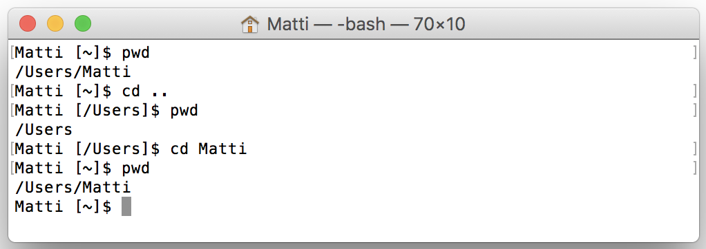
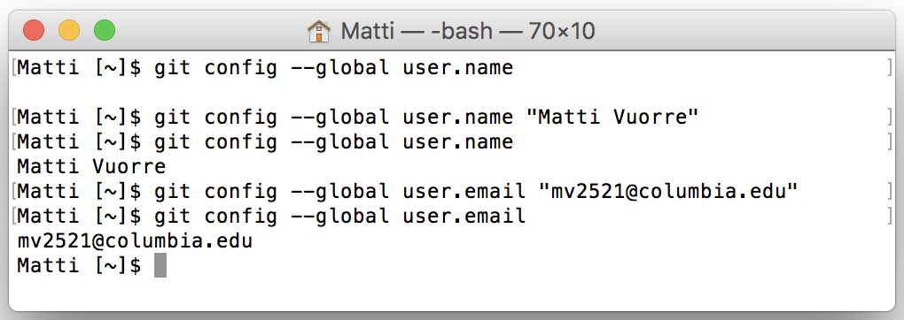
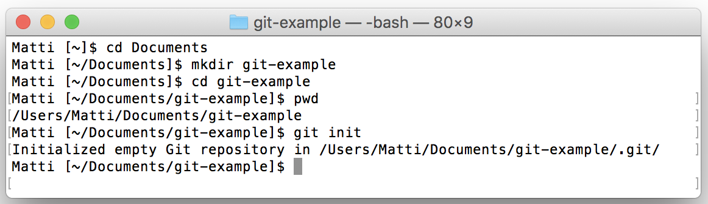

```{r include = FALSE}
library(knitr)
opts_chunk$set(
    fig.align = "center",
    root.dir = "../"
)
library(papaja)
library(tidyverse)
```

\newpage
This is a supplemental file to "Curating Research Assets in Behavioral Sciences". In this file, we show how to set up and use Git from the computer's command line, and highlight some more advanced Git functionality. The commands in this supplemental file run approximately parallel to the Git operations executed through the R Studio GUI in the main text.

# Git setup

Once you have installed Git, you can use it from the computer's command line or through a GUI. Although you can use Git with a GUI, it is important to learn a few basic Git commands from the OSs command line, because it is simultaneously the most basic and most flexible interface to Git's functionality. Understanding the basic Git commands as entered through the computer's command line also facilitates understanding its more advanced uses, and is highly recommended. For some Git functions, such as identifying its user, you will need to use a few command line functions, shown below. Before getting to the commands, we provide a brief introduction on how to use the computer's command line.

## The command line

The command line is a text-based interface for interacting with your computer, and its functionality greatly extends that of the standard way of interacting with the computer by clicking and pointing with a mouse. Many advanced techniques require using your computer through a command line, and it is very helpful in e.g. scripting and scheduling tasks on your computer. Here, we introduce the command line in just enough detail so that you can navigate folders on the computer, and set up Git's basic configuration (identify Git's user).

To access the command line interface, you need to use a command line "shell" application. Mac users can open the built-in app Terminal, and Windows users can use the Git Bash application, which is installed with the Windows Git program. After opening the command line shell, you can type in commands and execute them by pressing Return (Mac) or Enter (Windows). The most common command line functions are listed in Table \@ref(tab:cli-commands-table).

First, you need to know how to navigate the folders on your computer (a task that is typically done by clicking folders in Finder (Mac) or File Explorer (Windows)). This is important because whenever you execute commands in the command line, they are executed in a specific directory. Usually, when you open up your command line shell, you begin in the user's home directory (or folder, we use these terms interchangeably). Depending on your operating system, the home directory is usually represented with a `~` on the left side of the cursor. To ask for the current working directory, you can use the function `pwd`. To move up in the directory hierarchy (into the folder that contains the current directory), you can use `cd ..` (note the space). To move into a folder that is inside the current working directory, you can use `cd folder` where `folder` is the name of the desired folder. These command line functions are illustrated in Figure \@ref(fig:cli-intro) with the Mac Terminal application.

```{r cli-commands-table, results = 'asis'}
cli_tab <- tibble(
    Command = c("pwd", "cd ..", "cd folder", "ls"),
    Result = c("Show current directory.",
               "Move out of current directory (up one level).",
               "Move into folder (must be inside current directory).",
               "List files and folders in current directory.")
)
apa_table(cli_tab, 
          caption = "Basic command line functions.", 
          note = "Execute the commands in your command line shell application (e.g. Terminal (Mac) or Git Bash(Windows)) by pressing Return (Mac) or Enter (Windows).")
```

```{r cli-intro, fig.cap="The Terminal command line shell. The functions are explained in more detail in the text. Each command (prepended with a \\$ symbol) is followed by its output on the following line. To the left of the \\$ symbol, this user's shell application displays the user's user name and the current directory in square brackets. Here, the outputs are directories separated with forward slashes, and top-most (containing, also known as parent) folders are on the left of their subfolders (also known as children). Your command line interface might look slightly different because of different user and folder names, operating systems, and command line shell applications."}

```

## Setting Git's user information

Some users may find using a text-based command line interface unfamiliar, but to get started with Git, there are two required configuration commands which you need to run once, and the basic functionality requires using only a handful of commands[^cli-links]. The first step in using Git is making it aware of who is using the computer. You need to set the user's name and email address by entering a few basic commands in the command line. First, to show the current user information, run the following command in the command line: 

```bash
$ git config --global user.name 
```

In these code listings, each command is preceded by a `$` symbol to indicate that they are inputs to the command line. The command line typically displays this symbol (some versions might use another symbol, such as `>`) on the current line where commands can be entered. Do not type the `$` symbol as part of the command. To help remember the commands, we recommend typing them out, instead of copy-pasting. Executing the above command should not return anything, unless a previous user of the computer has set the global Git user name. Each Git command starts with the word `git`, then a command (such as `config`), and then arguments to the command, such as `--global` (for global configuration), followed by variables, such as `user.name`. To ensure that Git knows who you are, execute the following command (replacing `User Name` with your desired user name):

```bash
$ git config --global user.name "User Name"
```

This command maps `User Name` to Git's global `user.name` variable. If you now re-run the first command (`git config --global user.name`), the command line will return the user name you entered. The user name can be anything you'd like, but it is probably a good idea to use your real name so that potential collaborators know who you are. The second piece of information is your email address, which is entered by the following command (where `email@address.com` is your email address):

```bash
$ git config --global user.email "email@address.com"
```

You can verify that the correct email address was saved with `git config --global user.email`. These commands are shown as entered to the Terminal command line shell application in Figure \@ref(fig:cli-intro).

```{r git-setup, fig.cap="Setting up Git's configuration using the command line. Notice that for these configuration commands, the current working directory does not matter (we did them in the user's home directory)."}

```

Once this information is entered, Git will know who you are, and is able to track who is doing what and when within a project, which is especially helpful when you are collaborating with other people, or when you are working on multiple computers. For detailed instructions on how to use Git commands, you can type `git --help`. For help on how to use the `git config` command, type `git config --help`. When printed in the command line, some help pages run for several pages; you can press the space bar to move to the next page, or `q` to quit looking at the help page.

# Using Git from the Command Line

## Organizing Files and Folders

To create a new folder for the Git repository, you first choose an appropriate folder on your computer (such as `User/Documents/`) where you'd like to create the project. You can either use the system's file navigator (Finder / File Explorer) to create this folder, or use the command line: Navigate to the desired folder by using `cd Documents` to move into the `Documents` folder (assuming it exists in the folder where you currently are). Use `cd ..` to move out of a folder (to its containing folder), if needed.

## Initializing a Git Repository

Once you are in the folder where you want to create the project, type `mkdir git-example` to make the `git-example` directory, then `cd git-example` to move into it. You can, of course, also use the point-and-click interface (Finder or File Explorer) to create folders, instead of the `mkdir` command. Once you are in the project's home folder (you can verify where you are by typing `pwd`), you can turn the folder into a Git repository by initializing Git with the `git init` command. These commands are shown in Figure \@ref(fig:git-initialize).

```{r git-initialize, fig.cap = "Creating and navigating to a folder, and initializing it as a Git repository."}

```

Instead of screenshots, for the rest of the tutorial we present the commands as follows:

```bash
$ git init
```

The `git init` command initializes the folder as a Git repository, and the only change so far has been the addition of a hidden `.git` folder inside `git-example` (and possibly a `.gitattributes` file. Users can ignore these hidden files and folders, however they can be shown with the `ls -la` command.) Now that the folder is initialized as a Git repository, Git monitors any changes within it, and allows you to add and commit these changes.

## Adding a File to Git

To see what files have changed since the last status change in the repository, you can ask for Git's **status** (in subsequent code listings, command line input is prepended with `$`, and output is printed without preceding characters):

```bash
$ git status
On branch master
Initial commit
Untracked files:
  (use "git add <file>..." to include in what will be committed)
	README
nothing added to commit but untracked files present (use "git add" to track)
```

The relevant output returned from executing this command is the "Untracked files:" part. There, Git tells the user that there is an untracked file (`README`) in the repository. To start tracking changes in this file, we **add** it to Git's staging area by using the command `git add` followed by the file name (i.e. `README`, in our example, the file doesn't have an extension), or `.` which is a shortcut for adding all files with changes to the staging area.:

```bash
$ git add README
```

We have now added this file to the staging area, and if we are happy with changes to the file's status, we can **commit** the file to Git's history. Here, we've created a README file, and our commit command would look as follows:

```bash
$ git commit -m "Add README file."
```

The quoted text after the `-m` argument is the *commit message*. Entering this command to the command line returns a brief description of the commit, such as how many files changed, and how many characters inside those files were inserted and deleted. The distinction between adding and committing in Git is important: The adding stage allows the user detailed control of what to add to the staging area in preparation of a commit to Git's history. The commit, then, commits the files from the staging area to history. These two operations can be run simultaneously by including the `-a` option to `git commit` (e.g. `git commit -a -m "Commit message"`), but it may be more difficult to control what gets committed with this command, and we therefore recommend beginning users to do `git add` and `git commit` in separate commands.

## Keeping Track of Changes with Git

The `git-example` project (or rather, Git) now keeps track of all and any changes to README. To illustrate, you can change the text in the README file with a text editor, save the file, and then ask for `git status` on the command line:

```bash
$ git status
On branch master
Changes not staged for commit:
  (use "git add <file>..." to update what will be committed)
  (use "git checkout -- <file>..." to discard changes in working directory)
	modified:   README
no changes added to commit (use "git add" and/or "git commit -a")
```

Git can tell that the README file has been modified since the last commit. It is often useful to know exactly *how* a file has changed, before committing it. To view differences to a file not yet committed, use `git diff file`. It shows changes within `file`, line by line, highlighting removed lines of text with red and added lines with green. Once you are happy with the changes, you can repeat the add and commit steps from above to permanently record the current state of the project to Git's history (below we use the `.` shortcut for adding all files with changes[^dot-shortcut]):

```bash
$ git add .
$ git commit -m "Populate README with project description."
```

## What Does Git Know?

The real importance of these somewhat abstract steps becomes apparent when we consider the Git **log**. To reveal the commit log of your repository, call

```bash
$ git log
```

The output of this command shows that each commit is identified with a unique hash code (long alphanumeric string), which we can use to call for further information (see below); an author; a date and time; and a short commit message. Executing `git log` on our example project at this stage returns this:

```bash
commit 60cbe5c9b4a78e500314f791080381030577a035
Author: Matti Vuorre <mv2521@columbia.edu>
Date:   Tue Jun 13 17:20:27 2017 -0400
    Populate README with project description.
    
commit 16c475023ecbc99446164187eeaaab10647ac550
Author: Matti Vuorre <mv2521@columbia.edu>
Date:   Tue Jun 13 17:14:14 2017 -0400
    Add README file.
```

To see what exactly changed in the last commit (latest commits are at the top), you can call `git show` with the commit's hash code (only relevant parts of output shown below):

```bash
$ git show 60cbe5c9b4a78e500314f791080381030577a035
Author: Matti Vuorre <mv2521@columbia.edu>
Date:   Tue Jun 13 17:20:27 2017 -0400
    Populate README with project description.
diff --git a/README b/README
--- a/README
+++ b/README
@@ -0,0 +1,2 @@
+# Example Git Project
+This example project illustrates the use of Git.
```

This output is a detailed log of the changes in that commit. From top, it lists the commit's author, date, message, and then the commit's "**diff**". The diff is a detailed description of the changes introduced in that commit, explained in more detail below. The diff's first line tells that the following output is a git diff, and the origin of the changes was the `README` file (`a/README`), and the destination was the same file (`b/README`): 

```bash
diff --git a/README b/README
```

These two file names could be different if the content from a file was moved to another file with a different name, or if a file was moved. The next two lines expand the information presented in the previous line:

```bash
--- a/README
+++ b/README
```

The first and second line in this output show the file which received deletions (lines were removed, `---`) and the file which received additions (lines were added, `+++`). Alternatively, if a file was moved or renamed, these lines would indicate that. Following these lines, the output shows where the changes were made:

```bash
@@ -0,0 +1,2 @@
```

The `-0,0` indicates where in the initial version of the file the changes were made; the first number indicates the first line of changes, the second indicates for how many following lines the changes continued. This output is a little awkward, but because the file was initially empty, the changes must have occurred on the 0th line. The second pair of numbers (`+1,2`) indicates that the added text begins on line 1, and covers two lines of text. The last two lines of the output indicated the changes in the text. The two added lines are prepended with `+` symbols to indicate that these lines were added:

```bash
+# Example Git Project
+This example project illustrates the use of Git.
```

## (Slightly More) Advanced Git

### Make Git ignore files

To make Git ignore files, you simply add a plain text file called `.gitignore` to the home folder of the repository. You can use any text editor to create this file[^touch]. Notice that the file is *hidden* (by default, not visible in the OSs file viewer), but can be seen in the command line with the command `ls -la`. Each row of this file should specify a file or a folder (or a regular expression) that Git should ignore. In the current example you could make Git ignore the `admin/` folder entirely (first line in the code listing below), and any file with the .pdf extension inside `manuscript/` (second line). The example `.gitignore` file would look like this:

```bash
admin/
manuscript/*.pdf
```

Re-running `git status` now only shows the `plan_n.R` file and the newly created `.gitignore` file, which is also under version control, naturally. Because there are now two untracked files, which are not specified to be ignored in `.gitignore` (`.gitignore` and `plan_n.R`), and you usually should aim to maintain a clean commit history for the project, you can create two separate commits: One for the `.gitignore` file, and one for the power analysis file.[^when-to-commit]

```bash
$ git add .gitignore
$ git commit -m "Added .gitignore file"
$ git add .
$ git commit -m "Completed power analysis"
```

After this last commit you can, at any time in the future, come back to this commit with `git log` or `git show` and see what was inside the newly created power analysis file when it was first created. Below, we show some useful ways in which Git can be used to "rewind" the commit history.

## "Rewinding History" with Command Line Git Functions

### Try a new feature

We often find that making some changes to a project didn't have the desired effect: The manuscript ended weaker or the analysis didn't work anymore. Git allows great flexibility in trying new features, then undoing the changes[^git-branches]. Starting with an empty staging area, you could start modifying a file (e.g. `plan_n.R`) and later realize that the changes were not good. At this point it is common to press "Undo" in the text editor, but if the file has been saved multiple times or multiple files have been changed, it is difficult to get to the starting point by simply using the "Undo" button. Instead, with Git you can **checkout** the file's previous version from history. To undo all changes to `plan_n.R` (since the last commit), run

```bash
$ git checkout experiment-1/analysis/plan_n.R
```

Notice that you have to write the full path of the file (relative to the project's root) so that Git knows precisely which file you want to checkout from history. With these example operations, we have discussed the main Git operations: Make changes to files, **add** them to the staging area, **commit** to history; **checkout** from history to undo changes. 

### Undo committed changes

Another common scenario is one where a user makes changes to a file, adds the changes to the staging area, commits them to Git's history, and only then realizes that the changes weren't good. If you have committed changes to a file, and would like to revert back to an older version of the file, you could **checkout** the file's earlier version, and then commit the older version. [^undoing-more-info] For example, suppose you have made bad changes to a file called `file.txt`, and committed the changes to history, and would then like to undo the bad changes by reverting to an older version of the file. View the history with `git log` (you can use the `--oneline` argument for more concise output):

```bash
$ git log --oneline
4c64f11 Bad changes to file.txt
039d6ff Good changes to file.txt
a73f2ec Add file.txt
```

Recall that `git log` returns the most recent changes at the top, and notice that the `--oneline` argument has also made the commit hash codes shorter and thus easier to read and write. Here we can see that commit `039d6ff` has a good version of the file, and subsequent changes in commit `4c64f11` were bad (you would of course not commit "bad changes", but here the message is informative for clarity). To revert `file.txt` to it's good state in commit `039d6ff`, you can use use `git checkout hash filename`, which here would be:

```bash
$ git checkout 039d6ff file.txt
```

Now asking for `git status` reveals that `file.txt` has been modified in the working directory (its current state is as it was in commit `039d6ff`). You can now add and commit these changes with `git add file.txt`, then `git commit -m "Undid bad changes to file.txt"` (type a commit message suitable for your situation).[^undo-the-revert] `git log --oneline` would then show:

```bash
$ git log --oneline
bcbb123 Undid bad changes to file.txt
4c64f11 Bad changes to file.txt
039d6ff Good changes to file.txt
a73f2ec Add file.txt
```

This operation of checking out earlier versions is very useful not only for undoing changes, but for viewing older versions of files as well. However, if you would only like to view past states of the project, instead of reverting / undoing to earlier states of particular files, you can checkout an earlier version of the entire repository, as explained below.

### Going to an earlier version of the project

To return to an earlier state of the project, you can use the `git checkout` command. For example, the display above shows that in commit `a73f2ec`, you had added `file.txt`. If you would like to see the project at that commit, type `git checkout a73f2ec`. This command instantly checks out the file(s) at that point in history, and places them in the working directory where you can view them. This is very helpful if, for example, you would like to quickly run an earlier version of a statistical analysis, which may depend on multiple files. After you have viewed this old version of the project, you can return to the current version with `git checkout master`.

Both of these operations---checking out an earlier version of a file or of the entire project---are "safe" in the sense that your project's history won't be affected. However, checking out an earlier version of a specific file changes the current state of the project (the current version of the file is temporarily overwritten with the old version), so it is good practice to carefully keep track of the current version of your file before making further commits.

## Tagging important commits

Git also allows adding tags to commits. Tags can be used to signify important stages in the research cycle, or to mark otherwise particularly important commits. The simplest way to add a tag to the current commit is to use the `git tag` command followed by a name for the tag. The name should usually be a version number (e.g. v1.0), but text labels can be used as well. For example:

```bash
$ git tag v1.0
```

The above command will tag the current commit with the version number v1.0. All tags in the repository can be listed with `git tag`, and tagged commits can be accessed with their tag labels (e.g. `git show v1.0`). To create more informative tags (recommended), you can also use annotated tags by using the `-a` and `-m` options:

```bash
$ git tag -a v1.0 -m "Manuscript submitted"
```

Tags can become especially useful with larger projects. One common use for them is in software development to signify new versions or releases of the software.

# Collaborating

## Connect a Local Repository to a GitHub Remote Repository

After creating a GitHub repository, you need to link the existing local repository to the GitHub remote. To do this, use the following commands (the commands are also visible on GitHub, on a page that opens after you have created the repository):

```bash
$ git remote add origin https://github.com/username/reponame.git
```

Above, `username` and `reponame` are the user's GitHub user name, and the GitHub repository name. The correct address is visible in the GitHub page that opens after creating the repository. Once you have added the GitHub remote to the local repository, you can verify that the correct address was given with the command `git remote -v`. Once the connection is set up, we can **push** local changes to the GitHub remote:

```bash
$ git push -u origin master
```

The `-u origin master` arguments are only required for the first push, as they set up the connection. Running this command will send your local repository to the GitHub repository. For pushing changes following this initial push, simply type `git push` after adding and committing locally. You have now created the remote central repository, and other users can start contributing to it. 

## Cloning a Remote Repository

To clone a repository, first navigate to an appropriate location on the computer where you would like to create the local repository. Once the appropriate location is found, cloning will create a new folder for the repository inside this folder. Use `git clone` to clone a repository from a URL:

```bash
$ git clone https://github.com/username/reponame.git
```

To find out the correct URL to enter to `git clone`, you can navigate your web browser to the repository's GitHub address (e.g. <https://github.com/mvuorre/reproguide-curate> for this tutorial's repository) and click the big green "Clone or download" button; the complete address is in the text box. 

## Obtaining other's changes from the central repo

Just as you must manually push your own local changes to the remote repository, you must also obtain others' changes by **pulling** them from the central repo. Pulling is considered the first step in the collaborative workflow, because it is important that you start working on the most up to date version of the project (e.g. you don't want to reinvent the wheel or make unnecessary conflicting changes). Before starting to work on your proposed changes, pull the remote changes with:

```bash
$ git pull
```

## Resolving conflicts in collaborative work

Let's assume that a collaborator (User B) has made changes to the `README` file in the `git-example` project and pushed the changes to the central repository. For brevity, we only show the first few lines of this file (User B has added the second line):

```bash
# Example Git Project
Hello world!
This example project illustrates the use of Git.
```

At the same time, User A might have changed her local version of the `README` file to look like this (User A also added to the second line):

```bash
# Example Git Project
Here are some changes.
This example project illustrates the use of Git.
```

If User A now commits the changes locally, and attempts to push the changes to the central repository, an error will appear

```bash
$ git add .
$ git commit -m "Some meaningful changes"
$ git push
error: failed to push some refs
hint: Updates were rejected because the remote contains work that you
do not have locally. This is usually caused by another repository 
pushing to the same ref. You may want to first integrate the remote 
changes (e.g., 'git pull ...') before pushing again.
```

As is usually the case, Git also returns a hint on what to do, which you can follow to successfully resolve the conflict. Git suggests that User A first integrate the remote changes: She needs to first obtain the latest version of the file(s) from the central repository, add the proposed changes to the latest version of the file (the one containing User B's changes), and push that version.  She can first obtain the latest changes from the central repository:

```bash
$ git pull --rebase
```

The `--rebase` argument turns Git into rebasing mode, meaning that you are now applying your local commits on top of the "base" obtained from the remote repository. You can `git pull` without the `--rebase` argument, but that would create an unnecessary commit message and lead to a slightly different workflow[^pull-rebase]; we recommend using the `--rebase` argument. At this point, Git is in "rebasing" mode, allowing User A to resolve the conflict before pushing her changes. Running `git status` returns (only relevant output shown):

```bash
$ git status
rebase in progress; onto bada506
You are currently rebasing branch 'master' on 'bada506'.
  (fix conflicts and then run "git rebase --continue")
Unmerged paths:
  (use "git reset HEAD <file>..." to unstage)
  (use "git add <file>..." to mark resolution)
	both modified:   README
no changes added to commit (use "git add" and/or "git commit -a")
```

Git again shows a helpful (if rather jargony) message; the relevant point is that the repository is in rebasing mode (technically, User A is re-basing her current local version (`master`) onto User B's latest contribution, identified with `bada506`). The next step is to manually edit the conflicted file to reflect both User A's and User B's changes. Of course, the user who is doing the rebasing (i.e. merging or resolving the conflict) may simply decide to edit the file to reflect only her changes, completely rejecting User B's changes. When viewed with a text editor, the conflicting `README` file, on User A's computer, now looks like this:

```bash
# Example Git Project
<<<<<<< HEAD
Hello world!
=======
Here are some proposed changes.
>>>>>>> Some meaningful changes
```

The first line of the file was identical across the two Users' versions of the file, and therefore remains the same. However, after the first line, there is first a line (`<<<<<<< HEAD`) indicating that what follows are the to-be-integrated lines of text. Anything after this line up to the `======` line is the to-be-integrated text from the central repository. We can see that this is simply the line of text that User B created ("Hello world!"). After the separating line (`======`) are User A's local changes, followed by those changes' commit message ("Some meaningful changes") prepended with a `>>>>>>>`. User A can then edit this file however she chooses, using the tags to help her see which are her lines of code (text), and which are User B's. For example, User A may integrate the changes to make the file look like this:

```bash
# Example Git Project
Here are some proposed changes: Hello world!
This example project illustrates the use of Git.
```

Then, User A can save the file and add the changes with `git add README`. Importantly, because Git is in rebasing mode (which can be aborted with `git rebase --abort` to reject the central repository's changes and return User A back to her latest local version), User A should not commit but instead needs to complete the rebasing with `git rebase --continue`. 

```bash
$ git rebase --continue
Applying: Some meaningful changes
```

This command returns a reminder telling User A which local commit is being applied on top of the changes she pulled from the central repository, and then returns Git to it's normal mode from rebase mode. The final step is then to use `git push` to send the local changes to the central repository.

How these potential conflicts appear depends on how users collaborate with one another, and a detailed explanation of all potential scenarios is outside the scope of this tutorial[^more-on-conflicts]. Most importantly, even in the event of conflicts, all committed changes are saved in Git's history and can be retrieved, so experimenting with different approaches to resolving conflicts is safe. 

## Deleting a Git Repository

Finally, users may sometimes choose to delete their Git repositories. Deleting a project is as simple as moving the containing folder(s) to Trash (Recycle Bin on Windows), which also deletes the Git project (the Git project is contained in a hidden `.git` file in the project's home folder.) If you wish to only delete the Git repository, but keep the project itself, you can delete the `.git` folder. Because the folder is hidden, it will not show up in the default graphical file explorer. You can remove this folder using the command line by navigating to the project's root folder, and using the following command:

```bash
rm -rf .git
```

We recommend caution with this operation, as it will permanently delete the `.git` folder, which may contain important information. To verify that the folder was deleted, you can list all the files and folders in the current working directory, including hidden ones, with the following command:

```bash
ls -la
```

To delete a repository on GitHub, use your internet browser to navigate to the repository's GitHub address, click Settings, then "Delete this repository". Be aware that if anyone has cloned this project to their computer, you cannot delete their cloned versions.

\newpage

<!-- Footnotes -->
[^csv]: `.csv` stands for comma separated values, and is a plain text file commonly used to store two-dimensional data.
[^git-version]: As of the writing of this article, the current version of Git is 2.13.1.
[^git-name]: <https://git-scm.com/>. The creator of Git, Linus Torvalds (who also is the principal developer of the Linux operating system), named Git after himself as "the stupid content tracker" (@mcmillan_after_2005; <https://git-scm.com/docs/git.html>)
[^simple]: By "simple", we only mean that the technical aspects of the project, related to curating its materials, are simple. We of course do not suggest that there might be anything theoretically or scientifically simple in such projects.
[^vcs-collaborate]: The software we present below is used used by major software developers such as Microsoft, Google, and Facebook on code bases with hundreds of contributors.
[^cli-links]: If using a text-based command line seems challenging, Codecademy (<https://www.codecademy.com/learn/learn-the-command-line>) has a free interactive online tutorial, and MIT offers a free online game to teach using the command line (<http://web.mit.edu/mprat/Public/web/Terminus/Web/main.html>).
[^git-link-submodules]: For advanced users, Git *submodules* allow linking projects to each other, or organizing more complex projects into projects and their sub-projects (<https://git-scm.com/book/en/v2/Git-Tools-Submodules>).
[^git-cheat-sheet]: It helps to have a Git command cheat sheet (<https://services.github.com/resources/cheatsheets/>) printed and taped on your wall, but it contains many more commands than are needed for the basic use of Git in standard Psychology studies.
[^tier-link]: <http://www.projecttier.org/tier-protocol/specifications/>
[^git-branches]: A particularly powerful approach for trying new features is **branching**: The project can be duplicated to a new branch and modified, then merged back to the main branch after work on the new feature is complete---or the new branch can be discarded if the work ended unsatisfactory. Branches are outside the scope of this tutorial, for more information see the Git website (<https://git-scm.com/book/en/v2/Git-Branching-Branches-in-a-Nutshell>).
[^subversion]: <https://subversion.apache.org/>
[^mercurial]: <https://www.mercurial-scm.org/>
[^git-folder]: There are no visible changes to a folder once it is tracked by Git. Once Git is initialized in a folder, the only change is that a hidden folder, called `.git` is added, but users do not need to interact with it directly.
[^plain-text]: Plain text has many advantages over proprietary file formats such as Microsoft Word's .docx files. Briefly, plain text is both human and computer readable (.docx are unreadable without a copy of Microsoft Word), is both forward and backward compatible (there will always, and has always been, software capable of reading it), and plain text takes very little space. The file extension (the `.docx` part of a Word file's name, for example) of plain text doesn't matter much, but we recommend using either `.txt` because it is widely recognized, `.md` for markdown syntax, or in the case of a readme file, simply not using any file extension.
[^dot-shortcut]: For the `.` shortcut to work, you must currently be in the project's root directory. If you are not in the root directory, you can use `-A` shortcut instead. However, we recommend that you always ensure that you are in the project's root directory when running any Git commands.
[^when-to-commit]: It is entirely up to the user to decide what to commit and when. However, it is best practice to commit often while making incremental changes. Each commit should aim to solve one problem, introduce one new idea, or---more generally---do one thing. This way, when the commit history is reviewed later, it is easy to find and come back to a specific change.
[^undoing-more-info]: For more information on undoing changes, see <https://www.atlassian.com/git/tutorials/undoing-changes>.
[^undo-the-revert]: If, for some reason, you preferred the latest version after all, you can undo the revert process by `git checkout HEAD file.txt`, instead of adding and committing the older version. This function checks out the current state ("`HEAD`") which contained the bad changes.
[^pull-rebase]: For more information, see <https://www.atlassian.com/git/tutorials/comparing-workflows>.
[^github-private]: To obtain the free repositories, fill out the request form at <https://education.github.com/discount_requests/new>. Students with .edu email addresses, can obtain unlimited free repositories at <https://education.github.com/pack>.
[^more-on-conflicts]: Covering all different types of file conflicts is outside the scope of this tutorial. Although the instructions provided herein will help in most common use case scenarios, readers can refer to the following websites for more information: <https://help.github.com/articles/resolving-a-merge-conflict-using-the-command-line/> and <https://www.atlassian.com/git/tutorials/comparing-workflows>. You can also resolve conflicts on GitHub (<https://help.github.com/articles/resolving-a-merge-conflict-on-github/>), and the GitHub customer service is very responsive to users' help requests, which can include questions on code conflicts.
[^github-stats]: <https://github.com/about>.
[^rstudio-link]: R Studio is a free and open source IDE, works on Windows, Mac, and Linux operating systems, and can be downloaded from the project's website at <https://www.rstudio.com/products/rstudio/download/>.
[^touch]: You can also create this file in the command line by using the `touch` command: `touch .gitignore`. You can then open the file with a text editor to make changes to it.
[^r-not-required]: Although in this example we refer to the R programming language, Git can be used through the R Studio GUI even if you do not use R (or any other programming language.) 
